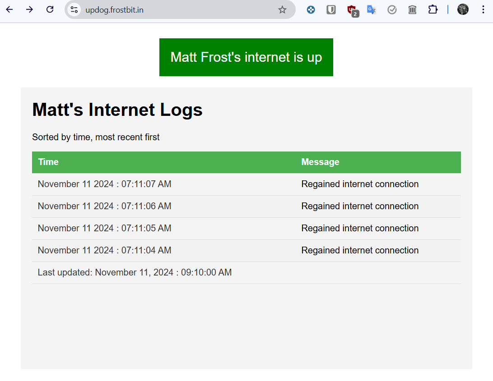
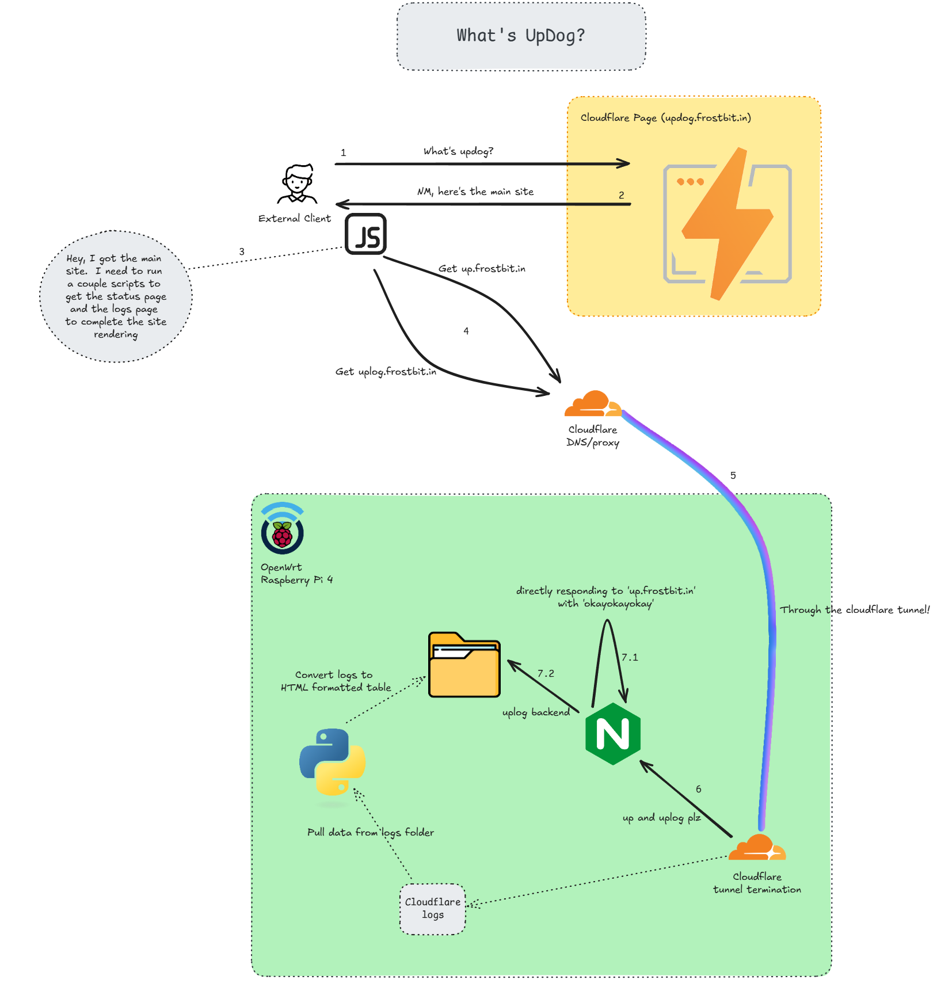

**How to Create a Cloudflare Tunnel-Based Internet Status Checker** 

This guide walks through the steps of creating a web page that displays your internet connection status, using Cloudflare Tunnels, OpenWrt, and a Cloudflare Page.



https://updog.frostbit.in

**Lore**

I see a post every month on my neighborhood's Facebook group asking if anyone else's internet is down.  I wanted to create a 'simple' way to check my internet status and share it with my neighbors.

Why set it up this way?  My main reason is that I wanted a way to check my internet status from anywhere without relying on a third-party uptime service or putting this on a server behind the router.  If the server goes down, I can't check the status.  This way, the status page is served directly from the router.  Also thrid party services limit the number of checks you can do in a minute.  This way, I can check as many times as I want.

PLUS, you get to tell people about "UpDog".  

- "What's UpDog?"  
- "Well I'm glad you asked.  It's my internet status page.  You can check it out at updog.frostbit.in."  
- "What's updog.frostbit.in?"
- "Not much, what's up with you?"
- "I hate you."
- "I know."


**Overview** 



This guide may have some missing steps or incorrect information.  I had created this a while ago and ended up dumping all my info into ChatGPT to create the documentation for me.  This is going to be more of a concept guide than a full step by step guide.  I'll try to fill in the blanks as I go.

You’ll set up:

1. A Cloudflare Tunnel to expose your OpenWrt router services.

2. A Cloudflare Page to create a public status page.

3. Nginx on OpenWrt to serve responses for status checks and logs.


**Main Components**
- `https://up.frostbit.in/test`: Responds with `okayokayokay` for simple status checks.
- `https://uplog.frostbit.in`: Serves formatted logs from cloudflare tunnel installed on OpenWrt.
- `https://updog.frostbit.in`: Public status page showing internet status and logs.

---

**Prerequisites**  
- OpenWrt router with `nginx`, `python3` and `cloudflared` installed.
 
- A domain name managed by Cloudflare (e.g., `frostbit.in`).

- Basic knowledge of Linux, DNS, and web servers.


**Some values in this doc to look out for and replace**
- `frostbit.in`: Your domain name.
- `10.10.101.1`: Your OpenWrt router IP.
- `updog-frostbit`: Your Cloudflare Page name.
- `Matt Frost`: Your name.
- `US/Eastern`: Your timezone.

---

**Setup Instructions** **1. OpenWrt Configuration** **Install Necessary Packages** 

Ensure the following are installed on your OpenWrt router:

- `cloudflared` (version ~ 2024.4.1-2)
 
- `nginx` (version ~ 1.25.0-4)

- `python3` (version ~ 3.11.7-1)

These are installed using the `opkg` package manager.


**Set Up Nginx**


Edit the `/etc/nginx/nginx.conf` file to include two server blocks:

```nginx
http {
    include /etc/nginx/mime.types;
    default_type application/octet-stream;

    # Server block for internet status
    server {
        listen 8888;
        root /www;

        add_header "Access-Control-Allow-Origin" "https://updog.frostbit.in";
        add_header "Access-Control-Allow-Methods" "GET, POST, OPTIONS";
        add_header "Access-Control-Allow-Headers" "Content-Type";

        location / {
            default_type text/html;
            return 200 'okayokayokay';
        }
    }

    # Server block for logs
    server {
        listen 8889;
        root /www;

        add_header "Access-Control-Allow-Origin" "https://updog.frostbit.in";
        add_header "Access-Control-Allow-Methods" "GET, POST, OPTIONS";
        add_header "Access-Control-Allow-Headers" "Content-Type";

        location / {
            alias /www/logs/;
        }
    }
}
```


These blocks will serve responses for internet status checks and logs.
- `8888`: Responds with `okayokayokay` for status checks.
- `8889`: Serves logs from `/www/logs/`.

Access-Control-Allow-Origin headers are set to allow requests from the Cloudflare Pages.


Restart Nginx on OpenWrt:

```bash
/etc/init.d/nginx restart
```


**Generate Cloudflare Log HTML code** 

Use the following Python script to format Cloudflare logs into an HTML file:


```python
#!/usr/bin/env python3

import json
from datetime import datetime
import os
import pytz

def format_time(time_str):
    dt = datetime.fromisoformat(time_str.replace('Z', '+00:00')).astimezone(pytz.timezone('US/Eastern'))
    return dt.strftime("%B %d %Y : %I:%M:%S %p")

def generate_html(file_path, output_path):
    html_header = """
    <!DOCTYPE html>
    <html lang="en">
    <head>
        <meta charset="UTF-8">
        <meta name="viewport" content="width=device-width, initial-scale=1.0">
        <title>Cloudflared Logs</title>

        <style>
            body {
                font-family: Arial, sans-serif;
                margin: 20px;
                padding: 0;
                background-color: #f4f4f4;
            }
            table {
                width: 100%;
                border-collapse: collapse;
            }
            th, td {
                padding: 10px;
                text-align: left;
                border-bottom: 1px solid #ddd;
            }
            th {
                background-color: #4CAF50;
                color: white;
            }
            tr:nth-child(even) {
                background-color: #f2f2f2;
            }
            .timestamp {
                color: #333;
            }
        </style>
    </head>
    <body>
        <h1>Matt's Internet Logs</h1>
        <p>Sorted by time, most recent first</p>
        <table>
            <thead>
                <tr>
                    <th>Time</th>
                    <th>Message</th>
                </tr>
            </thead>
            <tbody>
    """

    html_footer = """
            </tbody>
        </table>
    </body>
    </html>
    """

    seen_logs = set()  # To track seen (timestamp, message) pairs

    with open(file_path) as f, open(output_path, 'w') as out_file:
        out_file.write(html_header)
        # Reverse the file so that the most recent logs are at the top
        lines = reversed(list(f))
        for line in lines:
            try:
                log = json.loads(line)
                message = log['message']
                if message == "Lost connection with the edge":
                    message = "Lost connection with the internet"
                elif message == "Registered tunnel connection":
                    message = "Regained internet connection"

                if message in ["Lost connection with the internet", "Regained internet connection"]:
                    formatted_time = format_time(log['time'])
                    log_key = (formatted_time, message)

                    if log_key not in seen_logs:
                        seen_logs.add(log_key)
                        out_file.write(f"<tr><td class='timestamp'>{formatted_time}</td><td>{message}</td></tr>\n")
            except json.JSONDecodeError:
                continue

        current_time = datetime.now(pytz.timezone('US/Eastern')).strftime("%B %d, %Y : %I:%M:%S %p")
        out_file.write(f"<tr><td class='timestamp'>Last updated: {current_time}</td><td></td></tr>\n")
        out_file.write(html_footer)

if __name__ == "__main__":

    output_dir = '/www/logs'
    # Ensure the output directory exists
    os.makedirs(output_dir, exist_ok=True)

    generate_html('/var/log/cloudflared.log', '/www/logs/index.html')
```

This script reads the Cloudflare logs from `/var/log/cloudflared.log` and generates an HTML file in `/www/logs/index.html`.
 
- Save the script as `/root/log-to-html.py`.

- Add a cron job to update the logs every 5 minutes.

```bash
crontab -e
```

Add the following line:


```bash
*/5 * * * *  /usr/bin/python /root/log-to-html.py
```

**2. Cloudflare Tunnel Setup** **Create the Tunnel**  

1. Install `cloudflared` on your OpenWrt router.
 
2. Authenticate your Cloudflare account:


```bash
cloudflared login
```
 
3. Create a new tunnel named `home-router`:

```bash
cloudflared tunnel create home-router
```
 
4. Add the following configuration to `/etc/cloudflared/config.yml`:


```yaml
tunnel: 92b3e10f-2565-4440-8f2c-7cedf3dd1b7f
credentials-file: /root/.cloudflared/92b3e10f.json

ingress:
  - hostname: up.frostbit.in
    service: http://10.10.101.1:8888
  - hostname: uplog.frostbit.in
    service: http://10.10.101.1:8889
  - service: http_status:404
```
 
5. Run the tunnel:


```bash
cloudflared tunnel run home-router
```

**Set Up DNS** 

In your Cloudflare DNS settings:
 
- Add a CNAME record for `up.frostbit.in` pointing to your tunnel’s `UUID.cfargotunnel.com`.
 
- Add a CNAME record for `uplog.frostbit.in` pointing to the same tunnel.


---

**3. Cloudflare Page** **Write the Worker Script** Use the following Worker script for `updog.frostbit.in`:

```html
<!DOCTYPE html>
<html lang="en">
<head>
    <meta charset="UTF-8">
    <meta name="viewport" content="width=device-width, initial-scale=1.0">
    <title>Internet Status</title>
    <style>
        body {
            display: flex;
            flex-direction: column; /* Stack elements vertically */
            justify-content: center;
            align-items: center;
            height: 100vh;
            margin: 0;
            font-family: Arial, sans-serif;
        }
        .status {
            text-align: center;
            padding: 20px;
            color: white;
            font-size: 24px;
        }
        .up {
            background-color: green;
        }
        .down {
            background-color: red;
        }
        iframe {
            margin-top: 20px; /* Add some space between the status and iframe */
            width: 100%;
            max-width: 800px; /* Control the maximum width of the iframe */
            height: 500px;
            border: none;
        }
    </style>
</head>
<body>
    <div id="status" class="status">Checking status...</div>

    <iframe src="https://uplog.frostbit.in"></iframe>

    <script>
        // Function to check the status with a timeout
        function checkStatus() {
            const controller = new AbortController();
            const timeoutId = setTimeout(() => controller.abort(), 1000); // Timeout after 1 second

            fetch('https://up.frostbit.in/test', { signal: controller.signal })
                .then(response => response.text())
                .then(text => {
                    clearTimeout(timeoutId);
                    const statusElement = document.getElementById('status');
                    // Check if the response text contains 'okay'
                    if (text.includes('okayokayokay')) {
                        statusElement.textContent = "Matt Frost's internet is up";
                        statusElement.classList.add('up');
                    } else {
                        statusElement.textContent = "Matt Frost's internet may be down";
                        statusElement.classList.add('down');
                    }
                })
                .catch(() => {
                    clearTimeout(timeoutId);
                    const statusElement = document.getElementById('status');
                    statusElement.textContent = "Matt Frost's internet may be down";
                    statusElement.classList.add('down');
                });
        }

        // Check the status on page load
        window.onload = checkStatus;
    </script>
</body>
</html>

```

**Deploy the Page** 
1. Go to Cloudflare Workers & Pages.
 
2. Create a new Page named `updog-frostbit`.
 
3. Deploy the script (via Upload Assets) and bind the page to `updog.frostbit.in`.


---

**4. Testing** **Verify Each Endpoint**  
- `https://up.frostbit.in/test` → Should return `okayokayokay`.
 
- `https://uplog.frostbit.in` → Should show the HTML logs.
 
- `https://updog.frostbit.in` → Should display internet status and embed logs.


**Debugging Tips**  
- Check `cloudflared` logs for tunnel issues.
- Check Nginx logs for server issues.
- Check Zero Trust logs for tunnel connection status and issues.
- Use browser developer tools to debug fetch requests from the Worker.
- Check to make sure the python script is running and updating /www/logs/index.html.


---

**Caveats**

- Check your cache settings in Cloudflare to ensure the status page is always up-to-date.  I had mine set to always bypass cache, but since I'm sharing this with others, I've changed the cache settings to 1 minute.
- If too many people are checking the status page, you could kill your openwrt router.  I'm not sure how many people it can handle, but I'm guessing not many.  Maybe I'll find out O_O.
- If the router power cycles, the tunnel logs will be cleared.  “C'est la vie”.
- If the router is on but the tunnel is down, the logs will not be up to date until the tunnel comes back up.
- The logs will update every 5 mins, so the internet may be back up before the logs are updated on the status page.
- If you update the tunnel version, check the to make sure the tunnel comes back up after the update.  There's one time I had a bad version and the tunnel wouldn't come back up.
- No you don't get notifications if the internet goes down.  We're not that fancy here.
- Is there a better way to do this?  Probably.
- Should you be installing all these packages and assigning all these extra functions to a poor little Raspberry Pi 4 that's already running a critical service for your home network?  Probably not.  But here we are.

---

This guide should now provide almost all the information needed for others to replicate your setup!